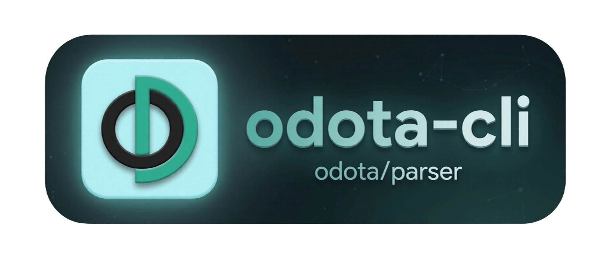

<p align="center">
  
</p>

<h3 align="center">odota-cli</h3>

<p align="center">
  <a href="#install">Install</a> •
  <a href="#usage">Usage</a> •
  <a href="#output-format">Output</a> •
  <a href="#build-from-source">Build</a> •
  <a href="#releases">Releases</a> •
  <a href="#license">License</a>
</p>

<p align="center">
  
  
  
  
</p>

---

CLI tool for parsing Dota 2 replay files into structured JSON.

## Prerequisites

- Go 1.26+
- Docker with [odota/parser](https://github.com/odota/parser) running on port 5600

## Install

```bash
go install github.com/drawiks/odota-cli@latest
```

Or grab a prebuilt binary (linux/macos/windows, amd64/arm64) from the [Releases](https://github.com/drawiks/odota-cli/releases) page — each release ships 6 binaries + `checksums.txt`.

## Usage

```bash
# Version (v0.1.0 when built by build.sh/CI, "dev" otherwise)
odota_cli --version

# Parse .dem file via Docker parser
odota_cli match.dem > match.json

# Custom parser URL
odota_cli --url http://localhost:5600 match.dem > match.json

# Read local NDJSON file (no Docker needed)
odota_cli match.ndjson > match.json
```

Inputs with `.ndjson` or `.json` extension are read locally as parser NDJSON output; anything else is treated as a binary `.dem` and POSTed to the parser (default `--url http://localhost:5600`).

## Output Format

### Match

```json
{
  "match_id": 8926354517,
  "duration_sec": 2238,
  "radiant_win": true,
  "players": [...]
}
```

### Player

```json
{
  "hero": "rubick",
  "team": "radiant",
  "kills": 5,
  "deaths": 3,
  "assists": 12,
  "healing": 1250,
  "hero_damage": 15000,
  "tower_damage": 3500,
  "stun_sources": [...],
  "buff_duration": 115,
  "buff_sources": [...],
  "silence_duration": 42,
  "silence_sources": [...],
  "break_duration": 18,
  "break_sources": [...],
  "disarm_duration": 31,
  "disarm_sources": [...],
  "heal_duration": 96,
  "heal_value": 400,
  "heal_sources": [...]
}
```

### buff_sources

Buffs given to allies (no self-cast).

```json
{
  "inflictor": "dazzle_shallow_grave",
  "category": "save",
  "duration": 5.0
}
```

**Categories:** save, purge, shield, spell_immunity, invisibility, buff_stats, buff_haste, mana_restore

### heal_sources

Healing items used on allies (no self-cast). HoT items carry `duration` (seconds), instant items carry `value` (HP healed).

```json
[
  { "inflictor": "item_urn_heal",       "category": "heal", "duration": 56 },
  { "inflictor": "bottle_regeneration", "category": "heal", "duration": 40 },
  { "inflictor": "item_great_famango",  "category": "heal", "value": 400 }
]
```

**Items:** urn of shadows, spirit vessel, essence distiller, bottle, pollywog charm (HoT); holy locket, healing lotus / great / greater healing lotus (instant).

### Tracked debuff durations

Per-player `*_duration` / `*_sources` pairs (sources sorted by duration desc):

| Pair | Given to | Sources |
|------|----------|---------|
| `stun_duration` / `stun_sources` | enemies | combatlog stun attribution |
| `buff_duration` / `buff_sources` | allies | BuffCategories map |
| `fear_duration` / `fear_sources` | enemies | fears, terrorize, sinister_gaze |
| `roots_duration` / `root_sources` | enemies | roots, ensnare, atos |
| `leash_duration` / `leash_sources` | enemies | puck coil, pounce leash |
| `trap_duration` / `trap_sources` | enemies | kinetic field, arena of blood |
| `taunt_duration` / `taunt_sources` | enemies | berserker's call, duel |
| `silence_duration` / `silence_sources` | enemies | silences, orchid, bloodthorn |
| `break_duration` / `break_sources` | enemies | silver edge, doom break |
| `disarm_duration` / `disarm_sources` | enemies | heaven's halberd, fate's edict, reactive tazer, deafening blast, tidal wave, concussive grenade |
| `heal_duration` / `heal_value` / `heal_sources` | allies | healing items: urn/vessel/distiller/bottle (duration), holy locket, healing lotuses (value) |

## Build from Source

```bash
git clone https://github.com/drawiks/odota-cli.git
cd odota-cli

# Single binary (unstamped --version says "dev")
go build -o odota_cli

# All 6 release binaries, stamped with the version from VERSION
./build.sh
```

## Releases

Versioning is manual and dead simple: bump plain semver in the `VERSION` file at the repo root, push to `main`, CI tests, builds the 6 binaries, and publishes a GitHub release (tag + title `v<version>`, auto-generated changelog notes, binaries + `checksums.txt`) — but only if `v$(cat VERSION)` isn't released yet. Want no release? Don't touch `VERSION`.

## License

MIT
